# Dictation — a React + Node learning walkthrough

This guide teaches the dictation subsystem — the mic button in the reply composer — by
explaining **why** each piece is shaped the way it is, contrasting every mechanism with
the naive alternative a first draft would have reached for. It is a *why* layer, not a
reference: for the endpoint table, the status codes and the accepted limits, read
[`docs/subsystems/dictation.md`](../../subsystems/dictation.md) instead.

> Mental model up front: dictation is a **local subprocess pipeline wearing a browser API
> on the front**. The browser's job is to capture a blob and hand it over; the server's
> job is to shell out to two binaries that were never designed to be part of a web app,
> and to do that without leaking anything, wedging anything, or running twice at once.
> Almost every decision here descends from one of two constraints: *the audio must not
> leave this machine*, and *a web request must not be allowed to become a fork bomb*.

> **Read it in a browser:** [`index.html`](./index.html) — this whole guide as one
> page, with the diagrams drawn and every cross-reference as an in-page jump. It is
> **generated** from these markdown files by [`tools/build.mjs`](./tools/build.mjs), so edit
> the markdown and re-run `node docs/guides/learning/dictation/tools/build.mjs`; never edit
> `index.html` by hand.

<!-- study-provenance: sources=server/lib/transcribe.ts,server/api.ts,client/src/hooks/useDictation.ts,client/src/hooks/useTranscribeAvailable.ts,client/src/components/MicButton.tsx,client/src/lib/dictation.ts commit=efea9f0 date=2026-08-17 -->

> Baseline: written against the dictation sources at commit `efea9f0` (2026-08-17).

## The whole shape

```mermaid
flowchart LR
  A["MicButton<br/>render gate"] -- "tap" --> B["useDictation<br/>MediaRecorder"]
  B -- "Blob, recorder mime" --> C["POST /api/transcribe<br/>raw binary body"]
  C -- "Buffer + ext" --> D["transcribe()<br/>mkdtemp scratch dir"]
  D -- "clip.m4a" --> E["ffmpeg<br/>-ar 16000 -ac 1"]
  E -- "clip.wav" --> F["whisper-cli -nt"]
  F -- "stdout" --> G["parseOutput"]
  G -- "{text}" --> H["appendTranscript<br/>into the textarea"]
```

Note what that picture does **not** contain: a queue, a job id, a websocket, a progress
stream. One request in, one string out, synchronously. That is a choice, and the chapters
below show what it buys and what it costs.

## Chapters

1. [Why local whisper at all](./guide/why-local-whisper.md) — the privacy constraint that
   is the parent of every piece of subprocess machinery in the backend.
2. [The render gate: three states, and the middle one is the whole lesson](./guide/render-gate.md) —
   hidden vs. disabled-and-labelled vs. live, plus the runtime error taxonomy that
   applies the same rule to `getUserMedia` rejections.
3. [The recorder lifecycle, and the two races hiding in it](./guide/recorder-lifecycle.md) —
   state vs. refs, one interval driving two features, and the two distinct windows in
   which a panel can die underneath a live microphone.

## Not yet covered

This guide was recorded part-way through the session, so four concepts from the subsystem
have no chapter yet. They are listed here rather than silently omitted:

- **The subprocess pipeline** — `mkdtemp` scratch dir with a `finally` cleanup, why
  `ffmpeg` normalises to 16kHz mono WAV, real files instead of pipes, the `run()` wrapper
  that never rejects, typed failures instead of raw stderr, and `parseOutput`'s defensive
  timestamp stripping.
- **Concurrency and caching** — the single-flight `inFlight` guard checked in two places
  (and why the early check is an optimisation, not a memory bound), the process-lifetime
  probe cache, and the memoised-promise-with-eviction in `useTranscribeAvailable`.
- **The wire format** — raw binary body with the recorder's own `Content-Type`, no
  multipart, no base64, and the `Content-Length` pre-check.
- **Security posture** — why `/api/health` publishes `transcribe` unauthenticated, the
  check ordering in `serveTranscribe`, and the four mitigations that stand in for a token.

For those, [`docs/subsystems/dictation.md`](../../subsystems/dictation.md) is the current
best source — it covers the *what* thoroughly, and a fair amount of the *why*.

## FAQ

Nothing here yet. This section is meant to hold the real questions raised during the
learning session, and the session was recorded before any were asked. Add to it when the
guide is next extended.

---

**Relevant files**

- [`client/src/components/MicButton.tsx`](../../../client/src/components/MicButton.tsx) — the three-way render gate; owns no logic beyond it.
- [`client/src/hooks/useDictation.ts`](../../../client/src/hooks/useDictation.ts) — the `MediaRecorder` state machine and both liveness races.
- [`client/src/lib/dictation.ts`](../../../client/src/lib/dictation.ts) — the pure half: mime pick, error copy, elapsed format, transcript folding.
- [`client/src/hooks/useTranscribeAvailable.ts`](../../../client/src/hooks/useTranscribeAvailable.ts) — the read-once-then-share engine probe, with eviction on failure.
- [`server/lib/transcribe.ts`](../../../server/lib/transcribe.ts) — ffmpeg + whisper spawns, temp-dir hygiene, typed failures, the single-flight flag.
- [`server/api.ts`](../../../server/api.ts) — `serveTranscribe`: the check ordering and the status-code mapping.
- [`docs/subsystems/dictation.md`](../../subsystems/dictation.md) — the reference doc this guide deliberately does not restate.
