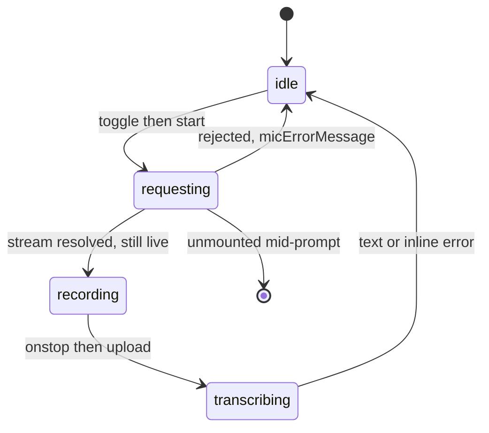
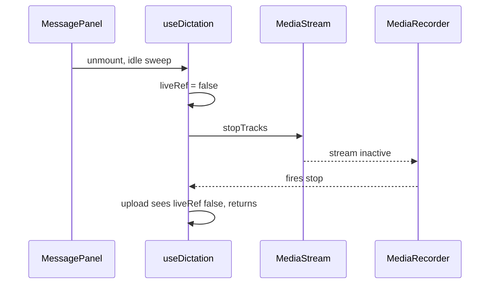

# The recorder lifecycle, and the two races hiding in it

[← back to contents](../README.md)

**The mental model for this file:** `useDictation` is a small state machine wrapped around
one browser object that has its own, *different* state machine — and the two can be torn
down by a third party (the panel unmounting) at any moment. Most of what looks like extra
code is there because those three clocks do not agree.



## State vs. refs

```ts
// client/src/hooks/useDictation.ts:28-37  (comment elided)
  const [phase, setPhase] = useState<DictationPhase>('idle');
  const [elapsed, setElapsed] = useState(0);
  const [error, setError] = useState('');
  const [token] = usePersistedState<string>('dashboard.answerToken', '');
  const recorderRef = useRef<MediaRecorder | null>(null);
  const streamRef = useRef<MediaStream | null>(null);
  const liveRef = useRef(true);
```

The split is exact, and the rule behind it is worth naming: **state is what the button
renders; refs are what the hook has to clean up.**

`phase` and `elapsed` are state because they *are* the UI — `🎙` versus `0:07` versus `…`.
`recorderRef` and `streamRef` are refs because nothing renders them; they are resources
with a `.stop()` that must be callable from a cleanup function.

**The bad alternative** — `const [recorder, setRecorder] = useState<MediaRecorder|null>(null)`
— is a common first draft and it fails twice. It re-renders the whole panel every time you
obtain an object nobody displays; and worse, an unmount cleanup that closes over
`recorder` sees whatever value existed *when that effect last ran*. You end up calling
`.stop()` on a stale object, or on `null`, while the real recorder keeps the mic light on.

## One interval drives two features

```ts
// client/src/hooks/useDictation.ts:45-55
  useEffect(() => {
    if (phase !== 'recording') return;
    setElapsed(0);
    const started = Date.now();
    const timer = setInterval(() => {
      const secs = Math.floor((Date.now() - started) / 1000);
      setElapsed(secs);
      if (secs >= MAX_SECS) recorderRef.current?.stop();
    }, 1000);
    return () => clearInterval(timer);
  }, [phase]);
```

Two features share this one timer: the visible `0:07` counter, and the hard 120-second cap
that keeps a forgotten recording from running until the tab dies.

**The bad alternative** is the obvious one — a `setInterval` for the display plus a
separate `setTimeout(stop, 120_000)` for the cap. It reads cleaner, one timer per job. But
now two clocks measure the same span, and they *will* disagree: `setInterval` drifts under
load and is throttled hard in a backgrounded tab, `setTimeout` drifts differently. The
user watches the counter reach `1:58` and the recording cuts, or it passes `2:04` and
keeps going. Neither is broken exactly — but the number on screen has stopped governing
the cap, so you can no longer debug one by looking at the other.

Deriving both from a single `Date.now()` baseline means the cap fires *because* the
displayed number hit 120. There is one clock, and it is the one you can see. Note also
that `started` is captured once rather than counting ticks: throttled or dropped ticks make
the counter jump, but never make it lie.

## Race one: the panel closes while the permission prompt is open

This hook lives inside `MessagePanel`, the turn-end reply window — and per
[`docs/subsystems/remote-message.md`](../../../../subsystems/remote-message.md) that panel has
an **idle sweep that tears it down on its own**, with nobody clicking anything. So: you tap
the mic, iOS puts up "Allow microphone?", you hesitate, and the panel dies underneath the
dialog.

```ts
// client/src/hooks/useDictation.ts:102-114  (comment elided)
    try {
      const stream = await navigator.mediaDevices.getUserMedia({ audio: true });
      if (!liveRef.current) {
        stream.getTracks().forEach(t => t.stop());
        return;
      }
      streamRef.current = stream;
      const mimeType = pickMimeType(t => MediaRecorder.isTypeSupported(t));
      const rec = new MediaRecorder(stream, mimeType ? { mimeType } : undefined);
```

You then tap "Allow" — and `getUserMedia` resolves, handing a **live microphone stream to a
component that no longer exists**. Nothing will ever clean it up, because the cleanup
already ran, before this stream existed. The mic indicator stays lit until the tab dies.
The check right after the `await` is the fix: not live, so stop the tracks here and arm
nothing.

### Why a ref, and not the usual `let live`

```ts
// client/src/hooks/useDictation.ts:34-36
  // Same liveness idiom as useRemoteAnswer.ts's `let live`, adapted to a ref:
  // `start` is a memoized callback that outlives any one effect run, so the
  // flag has to survive in something a later effect can still flip off.
```

The standard React idiom is a plain `let live = true` inside the effect, flipped in its
cleanup — and `useTranscribeAvailable` does exactly that, five files away, correctly,
because its async work is *started by* the effect. But `start` is a `useCallback`: it is
invoked from a click handler long after any effect ran, and it survives across renders. A
closed-over `let` would be pinned to whichever effect run created it. A ref is the one box
that a memoized callback and a future cleanup can both see the same cell of.

A rule of thumb worth keeping: **`let live` when the async work begins and ends inside one
effect; a ref when the async work is started by something that outlives the effect.**

## Race two: `onstop` fires *because* you cleaned up

This one is genuinely surprising the first time.

```ts
// client/src/hooks/useDictation.ts:60-66
  useEffect(() => {
    liveRef.current = true;
    return () => {
      liveRef.current = false;
      stopTracks();
    };
  }, [stopTracks]);
```

The unmount cleanup stops the stream's tracks. Reasonable. But per the MediaStream
Recording spec, ending all of a stream's tracks makes the stream **inactive**, and an
inactive stream **stops the recorder**, which **fires its `stop` event**. So the cleanup
does not merely release the mic — it triggers the recorder's own stop handler on the way
out:

```ts
// client/src/hooks/useDictation.ts:117-120
      rec.onstop = () => {
        stopTracks();
        void upload(new Blob(chunks, { type: rec.mimeType || mimeType || 'audio/mp4' }));
      };
```

Which calls `upload`. Which is why `upload` opens with the second liveness check:

```ts
// client/src/hooks/useDictation.ts:75-76
    if (!liveRef.current) return;
    setPhase('transcribing');
```



Without that check the app would POST a clip of up to 8MB, occupy the server's
**single-flight transcription slot** — only one whisper run exists at a time, and everyone
else gets a 429 — burn several seconds of CPU, and hand the transcript to a `setPhase` on
a component nobody is looking at. You would be starving a real user's dictation to
transcribe audio for a dead panel.

**The bad alternative** here is not "no check". It is the tempting-looking fix of *not
stopping tracks in the cleanup*, since that is what sets the cascade off. Do not. On iOS a
stream you never explicitly stop leaves the orange mic dot lit and holds the microphone
against other apps. The hook comment is blunt about it: a mic indicator still lit after
you stopped reads as a bug, and on iOS it is one.

So the cascade is the *correct* behaviour, and the guard exists to make correct behaviour
survivable. Two checks, two genuinely different windows: `start`'s covers a stream **still
resolving**, `upload`'s covers a recording **already running**. Neither subsumes the other.

## The hook does not know a textarea exists

```ts
// client/src/hooks/useDictation.ts:27
export function useDictation(onText: (text: string) => void): DictationState {
```

The transcript leaves through a callback. `useDictation` never imports `MessagePanel`,
never touches a value or a setter, and never learns that the text becomes a Claude Code
reply. `MessagePanel` folds it in with `appendTranscript`. `MicButton` is equally ignorant
— it hands text to `onText` and knows nothing about what the text is for.

**The bad alternative** is passing the textarea's `value`/`setValue` pair into the hook.
Fewer moving parts today. But then the hook owns the append-versus-replace policy, the
4000-character cap, and the never-auto-send rule — three decisions that belong to the
composer, not to the microphone. And `appendTranscript` would stop being a pure function
testable with node-assert and no DOM, which is exactly how this repo tests client code;
[`client/src/lib/dictation.ts`](../../../../../client/src/lib/dictation.ts) says so in its own
header comment.

The seam pays off concretely: the mic drops into any composer, and the interesting logic —
mime picking, error copy, elapsed formatting, transcript folding — sits in a 75-line pure
module with zero browser API in it.

---

Back to [the contents](../README.md), or read
[`docs/subsystems/dictation.md`](../../../../subsystems/dictation.md) for the server half.
