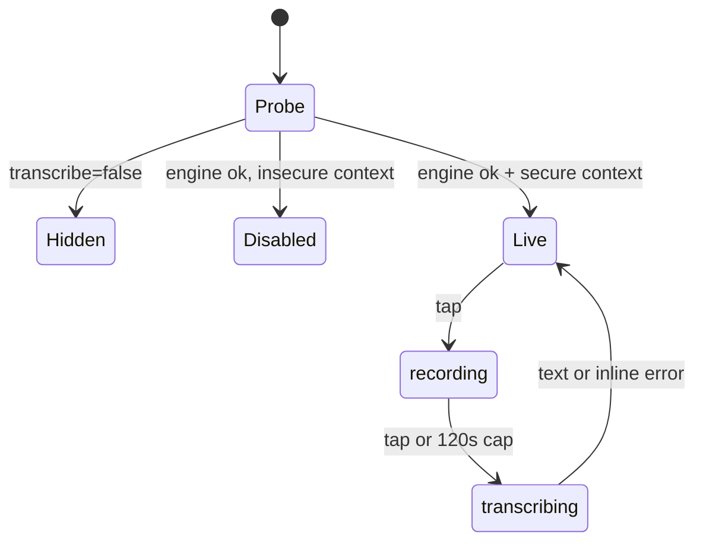

# The render gate: three states, and the middle one is the whole lesson

[← back to contents](../README.md)

**What it does.** `MicButton` can render three different ways before a single byte of
audio exists — nothing at all, a dead-but-labelled button, or the working mic:

```tsx
// client/src/components/MicButton.tsx:18-30
  const available = useTranscribeAvailable();
  const { phase, elapsed, error, toggle } = useDictation(onText);

  if (!available) return null;

  const secure = typeof window !== 'undefined' && window.isSecureContext;
  if (!secure) {
    return (
      <button type="button" className="qp-mic" disabled title="needs HTTPS — run `pnpm tunnel`">
        🎙 https only
      </button>
    );
  }
```



## Why the secure-context check exists

`getUserMedia` — the API `MediaRecorder` is built on — is gated to
[secure contexts](https://developer.mozilla.org/en-US/docs/Web/Security/Secure_Contexts):
HTTPS, or `localhost`. It does not *fail* outside one; it does not **exist**.

Now look at who this feature is for. Someone on their phone, away from the desk,
answering a session over a tailnet URL like `http://mac.tailnet.ts.net:4173`. Plain http.
The exact case dictation was built for is the exact case the browser forbids — which is
why `pnpm tunnel` went from a convenience (no port number in the bookmark) to the only
route that lets a phone dictate at all. See
[`docs/subsystems/remote-access.md`](../../../subsystems/remote-access.md).

## The bad alternative

Fold it into the availability check: `if (!available || !secure) return null`. One line
shorter, one render branch fewer, and the button simply is not there when it cannot work.

| | Hide it | Show it disabled, labelled with the fix |
|---|---|---|
| Code | one boolean | a whole extra render branch |
| Desk user on localhost | identical | identical |
| Phone user over plain http | never learns dictation exists | sees `🎙 https only`, tooltip names `pnpm tunnel` |
| Support cost | "the mic never showed up" — unfalsifiable | self-diagnosing |

A missing button is indistinguishable from a feature that does not exist, from a bug, and
from a broken deploy. A **dead button that names its own cause** collapses all three into
one glance.

Note that the *first* branch goes the other way: with no engine on the server, the
component renders nothing at all. There, an explanation would be permanent noise on a
machine that will never have whisper installed. So the rule is not "always explain" — it
is **explain when the condition is fixable by the person looking at it.**

## The same bet, applied at runtime

A secure context only buys the right to *ask*. `getUserMedia` can still reject, and the
rejection that matters most on a phone is the one that shows no dialog at all: when the
browser already holds a `denied` decision — for the origin, or for the browser app itself
at the OS level — it rejects immediately and prompts nobody. "It didn't ask me" is a
symptom, not the absence of one.

```ts
// client/src/lib/dictation.ts:34-54  (comments elided)
export function micErrorMessage(err: unknown): string {
  const name = (err as { name?: unknown } | null)?.name;
  switch (typeof name === 'string' ? name : '') {
    case 'NotAllowedError':
    case 'SecurityError':
      return 'mic blocked — allow it in browser + OS settings';
    case 'NotFoundError':
    case 'OverconstrainedError':
      return 'no microphone found';
    case 'NotReadableError':
    case 'AbortError':
      return 'mic busy in another app';
    case '':
      return 'microphone unavailable';
    default:
      return `microphone unavailable (${name as string})`;
  }
}
```

The naive version is `catch { setError('microphone unavailable') }` — one string for every
failure. The subsystem doc records that this cost a real debugging session, and the reason
is precise: "microphone unavailable" reads as *this machine has no mic*, in exactly the
situation where the truth is *the browser decided "no" months ago and did not bother to
ask again*. Two unrelated problems wearing one sentence.

The `default:` branch is the part worth stealing. It keeps the generic wording but appends
the raw `DOMException.name`, so a failure nobody anticipated still reaches the user
carrying the one token they need to search for it. That is cheap insurance against your
own error taxonomy being incomplete — which it always is. The alternative, an exhaustive
`switch` with no default, is not more correct; it is the same gap with the evidence
deleted.

---

Next: [The recorder lifecycle](./recorder-lifecycle.md) — what happens after the tap.
