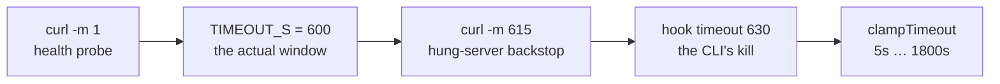
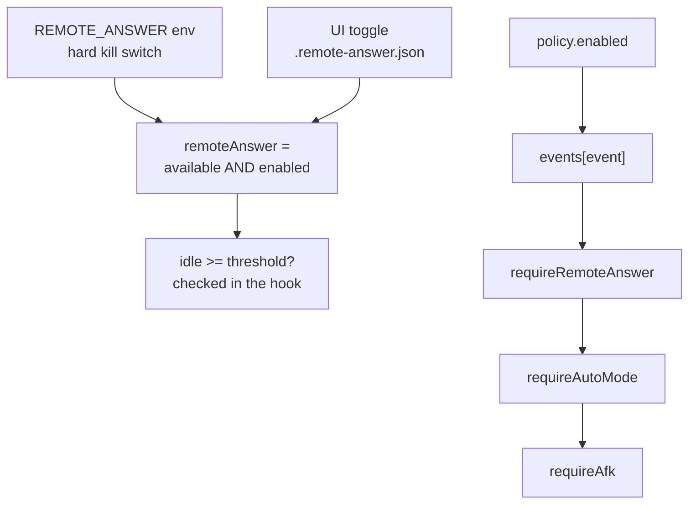

# Timeouts, gates, and config precedence

Four timeouts guarding one wait, three sources resolving one number, and four independent gate
stacks that are easy to conflate.

> Mental model: every layer here is **strictly larger than the layer it guards**, and every
> misconfiguration degrades to the terminal dialog rather than breaking. The ladder is
> designed so that getting it wrong is survivable.

## 1. The timeout ladder



| Layer | Value | Owner | What it guards against |
|---|---|---|---|
| Health probe | `curl -m 1` | the hook | A hung or absent dashboard adding latency to every prompt |
| The window | `TIMEOUT_S`, default 600s | the server's `setTimeout` | Waiting forever for an answer that isn't coming |
| curl cap | `TIMEOUT_S + 15` | the hook | A server that accepted the POST and then hung |
| CLI hook timeout | `timeout: 630` in settings.json | Claude Code | A hook that never returns |
| Store clamp | 5s … 1800s | `clampTimeout` | A hostile or absurd hook-supplied value |

**Why the server owns the deadline rather than curl:**

```bash
# scripts/ask-remote-hook.sh:94-96
# 3. Register and wait. The server resolves this itself at the deadline, so
#    curl's own cap is only a backstop for a hung server. A non-2xx, a reset
#    (server restarted), or a timeout all mean: use the terminal dialog.
```

The server knows *why* the wait ended — answered, timed out, dismissed, superseded, released —
and reports it. A curl timeout would only tell the hook "no reply", collapsing five
distinguishable outcomes into one.

**The bad alternative** — let curl's `-m` be the deadline and skip the server-side timer
entirely:

| | server owns the deadline (chosen) | curl's `-m` is the deadline |
|---|---|---|
| The hook learns why | Yes — a typed `status` field | No, just "no response" |
| Store cleanup | `settle()` removes the entry and clears its timer | Entry leaks until something else evicts it |
| Browser sees the expiry | Yes — the entry disappears from `getPending` | Panel keeps showing a dead question |
| Cost | Two timers for one wait | One |

The redundancy buys observability. And the `+ 15` on curl's cap is what makes it a genuine
backstop instead of a competitor — it can only fire if the server has already failed to.

## 2. The 630 vs 600 constraint, enforced from both ends

Every blocking script's header carries the same warning:

```bash
# scripts/ask-remote-hook.sh:22-24
# The timeout MUST exceed the wait window, or the CLI kills the hook first. The
# window is Settings → "Answer window" (max 600s there for exactly this reason);
# raising it past ~615s means raising this number too.
```

If the CLI's `timeout` is smaller than the window, **the CLI kills the hook mid-wait** — which
degrades to the terminal dialog. Even a misconfigured ladder fails safe.

The UI enforces it from the other end, twice. First the field simply won't go higher:

```tsx
// client/src/components/settings/SettingsView.tsx:268-274
<NumberField
  value={server.state.answerSecs}
  min={5}
  max={600}
  unit="sec"
  onCommit={answerSecs => void server.save({ answerSecs })}
/>
```

And if a value above 600 arrives some other way, it names the exact number you would need:

```tsx
// client/src/components/settings/SettingsView.tsx:289-297  (compacted here)
{server.state.answerSecs > 600 && (
  <div className="set-warn">
    Above 600s the CLI kills the hook before the window closes, unless you also raise
    <code>timeout</code> on the hook entry in <code>~/.claude/settings.json</code> to at least
    <code>{server.state.answerSecs + 15}</code>. Until then it falls back to the terminal dialog early.
  </div>
)}
```

Meanwhile the server clamps to a *wider* bound:

```ts
// server/lib/settings.ts:42-45
export const DEFAULT_ANSWER_SECS = 600;
/** Mirrors `MIN_TIMEOUT_MS` / `MAX_TIMEOUT_MS` in `pending.ts` — the same window. */
export const MIN_ANSWER_SECS = 5;
export const MAX_ANSWER_SECS = 1800;
```

**Why the UI caps at 600 but the store allows 1800.** This looks like an inconsistency and is
deliberate layering: the *store* should not refuse a value that works perfectly well for
someone who also raised their hook timeout, while the *UI* should not offer a value that
silently breaks with the documented install. So the hard bound lives on the server and the
advice lives in the UI — plus a warning for the gap between them.

**The bad alternative** is making the server enforce 600 too:

| | wide store bound + UI advice (chosen) | server clamps to 600 |
|---|---|---|
| Power user with `timeout: 1200` | Supported | Silently clamped, no explanation |
| Default install | Warned before it can break | Cannot break |
| Consequence of the gap | One early fallback to the terminal dialog | — |

The cost of the gap is bounded and visible: your window ends early and you get the terminal
dialog. That is the same outcome as every other failure in this subsystem.

## 3. Precedence: three sources, resolved in one line of shell

```bash
# scripts/ask-remote-hook.sh:48
IDLE_MIN_S="${CLAUDE_DASHBOARD_IDLE_SECS:-$(printf '%s' "$HEALTH" | jq -r '.idleSecs // 60')}"
```

Read right-to-left: **exported env var → the dashboard's Settings (carried on the health
probe) → hardcoded default.** The same one-liner shape resolves `answerSecs`.

**Why Settings rides on the health probe** rather than having its own endpoint:

```bash
# scripts/ask-remote-hook.sh:43-47
# Seconds without keyboard/mouse input before you count as away. 0 disables the
# check (always wait — the pre-idle-arbiter behaviour). An explicitly exported
# env var wins; otherwise the dashboard's Settings page owns it, carried on the
# probe above so no extra round trip is needed. Anything non-numeric (old server,
# odd payload) falls back to 60 rather than being trusted blind.
```

The probe is already happening — it is gate 1 — so piggybacking two integers on it costs
nothing.

**The bad alternative** is a `GET /api/settings` call. That doubles the latency added to
*every* permission prompt and tool call in every session, to fetch two numbers that were
already in flight.

**Why the env var wins over the UI:** it is the escape hatch for a setup the UI cannot model —
Docker, CI, a second dashboard on another port. But a silently-losing UI control is a bad
experience, so the server *detects* the override and the UI says so:

```ts
// server/lib/settings.ts:157
export function detectEnvOverride(name: string, homeDir?: string): EnvOverride | null {
```

It checks both the shell environment and the `env` block of `~/.claude/settings.json`, and the
Settings page renders which one, with an honest disclaimer: *"Remove it for the value above to
take effect. The dashboard won't edit that file for you."*

**Why not just edit that file:** it is the user's global Claude Code config, shared by every
project and every session. A dashboard that rewrote it to make its own slider work would be
reaching far outside its remit. Reporting the conflict is the correct scope.

## 4. Four gate stacks people conflate



**Stack 1 — is the feature on?** ([`remoteState.ts`](../../../../server/lib/remoteState.ts))

```ts
// server/lib/remoteState.ts:52-60
export function getState(config: Config): RemoteAnswerState {
  if (cached === null) cached = readStored() ?? config.remoteAnswer;
  return {
    available: config.remoteAnswer,
    enabled: cached,
    remoteAnswer: config.remoteAnswer && cached,
    persisted
  };
}
```

The hook is only ever told the **product**. It never learns which layer said no, and doesn't
need to — every answer is the same `exit 0`.

`setEnabled` returns `null` when the env gate is off, so **the toggle cannot turn the feature
on.** Env is a hard kill switch; the toggle only operates inside what env permits.

**Why the toggle is persisted** — the only thing this app writes to disk:

```ts
// server/lib/remoteState.ts:14-17
 * The toggle is persisted because `tsx watch` restarts the server on every edit
 * and a switch you flipped before walking away must survive that. It is the only
 * thing this app writes to disk, and it fails open: an unwritable path keeps the
 * in-memory value and reports `persisted: false` so the UI can say so.
```

A dev-loop detail drove a persistence decision, and the fail-open path (unwritable disk still
works this run, and says so) means a read-only container doesn't lose the feature.

**Stack 2 — should *this* one wait?** The idle check, in the hook, per invocation. Never on the
server, because the server can't see your keyboard from inside a container.

**Stack 3 — should it push?** ([`notify.ts`](../../../../server/lib/notify.ts)) Orthogonal to the
other two — it governs *notifications*, not waits:

```ts
// server/lib/notify.ts:65-69
export function shouldNotify(event: NotifyEvent, policy: NotifyPolicy, ctx: PredicateContext): boolean {
  if (!policy.enabled) return false;
  if (!policy.events[event]) return false;
  if (policy.requireRemoteAnswer && !ctx.remoteAnswer) return false;
  if (policy.requireAutoMode && !AUTO_MODES.has(ctx.permissionMode ?? '')) return false;
```

`requireAutoMode` is the reason `permissionMode` is threaded through every hook POST — you will
see `--arg pm "$PERM_MODE"` in all four POSTing scripts, with the note *"Absent on older CLIs,
which simply never satisfy that layer."* A missing field disables one policy layer rather than
erroring.

**Stack 4 — the wait endpoint vs the answer endpoint.** One asymmetry that reads as a slip
until you follow it through. `serveQuestionWait` gates on `getState(config).remoteAnswer` (env
**and** toggle); `serveSessionAnswer` gates on `config.remoteAnswer` (env only).

So flipping the toggle off stops *new* waits from registering but does not strand one already
held. And the toggle handler releases the held ones deliberately:

```ts
// server/lib/pending.ts:256-266
/**
 * Hand every waiting question back to its terminal dialog. Used when the toggle
 * is switched off: "stop accepting remote answers" should release the waits it
 * already owns, not leave them parked until their deadlines.
 * Returns how many were released.
 */
export function dismissAll(): number {
  const waiting = [...entries.values()];
  for (const entry of waiting) settle(entry, { status: 'dismissed' });
  return waiting.length;
}
```

**Why not gate the answer endpoint on the toggle too:** a wait that is *already held* has a
hook blocked on it. Refusing the answer would leave that hook waiting out its full deadline
with no way to resolve early — the exact opposite of what "stop accepting remote answers"
should mean. Turning the switch off releases what it owns; it does not orphan it.

## 5. The values, in one table

| Constant | Value | Where |
|---|---|---|
| `DEFAULT_IDLE_SECS` | 60 | [`settings.ts:37`](../../../../server/lib/settings.ts) |
| `MAX_IDLE_SECS` | 3600 | `settings.ts:39` |
| `DEFAULT_ANSWER_SECS` | 600 | `settings.ts:42` |
| `MIN_ANSWER_SECS` / `MAX_ANSWER_SECS` | 5 / 1800 | `settings.ts:44-45` |
| `DEFAULT_TIMEOUT_MS` | 600_000 | [`pending.ts:44`](../../../../server/lib/pending.ts) |
| `MIN_TIMEOUT_MS` / `MAX_TIMEOUT_MS` | 5_000 / 1_800_000 | `pending.ts:45-46` |
| `PERMISSION_TTL_MS` | 30 min | [`permissions.ts:26`](../../../../server/lib/permissions.ts) |
| idle reaper interval | 5s | [`messages.ts:210`](../../../../server/lib/messages.ts) |
| `TEXT_CAP` (follow-up) | 4000 | `messages.ts:27` |
| `QUESTION_CAP` / `LABEL_CAP` / `DESCRIPTION_CAP` | 2000 / 200 / 500 | `pending.ts:37-39` |
| CLI Stop-block cap | 8 | `CLAUDE_CODE_STOP_HOOK_BLOCK_CAP` |
| hook `timeout` (blocking) | 630 | `~/.claude/settings.json` |
| hook `timeout` (display-only) | 5 | `~/.claude/settings.json` |

The caps in the last rows are not ceremony. `pending.ts` states the reason: *"Length caps — a
hostile/runaway tool input must not pin memory."* The store holds entries in RAM with no size
bound other than one-per-session, so the per-field caps are the memory bound.

---

[↑ back to contents](../README.md)
