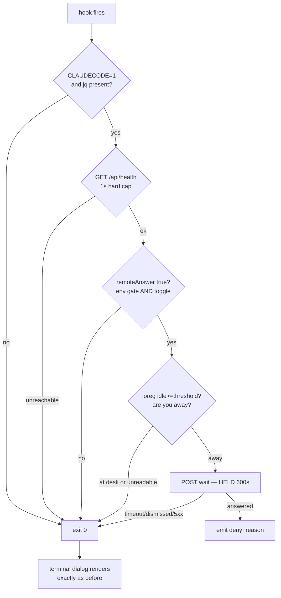
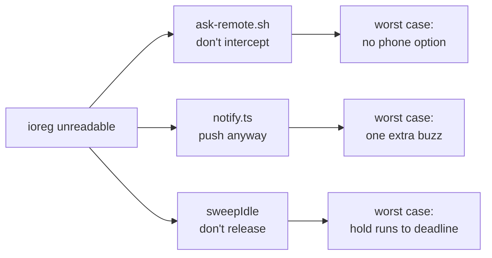

# Fail-open, hook by hook

Twelve bail-outs, one success path — and three call sites that fail deliberately opposite ways
on the very same signal.

> Mental model: **the hook's exit is what lets the terminal UI render.** So every guard has
> the same escape: `exit 0`, and the dialog appears exactly as it would have without the hook
> installed. Fail-open toward the terminal is the invariant the whole subsystem is built to
> preserve.

## 1. The gate stack



Every edge except one lands on `exit 0`.

## 2. Why the arbitration is necessary at all

```bash
# scripts/ask-remote-hook.sh:7-13
# A question can't be live in the terminal AND answerable from the phone (the
# dialog only renders once this hook exits), so three gates decide who gets it:
#   1. REMOTE_ANSWER on the server — is the feature available at all?
#   2. the dashboard toggle        — am I accepting remote answers right now?
#   3. keyboard idle, below        — am I actually away from the desk?
# At the desk, gate 3 falls through instantly, so the terminal dialog behaves
# exactly as it did before this hook existed.
```

This is a genuine either/or, not a preference. The hook must decide *before* the dialog exists
whether the dialog should exist. There is no design in which both surfaces are simultaneously
live.

## 3. The complete inventory

| Guard | Fails to | Reasoning |
|---|---|---|
| `CLAUDECODE != 1` | terminal | Script may be invoked outside the CLI; nothing to hook |
| no `jq` | terminal | Can't parse the payload at all |
| `tool_name != ExitPlanMode` | terminal | *"A matcher is configuration, so never trust it alone"* |
| `/api/health` unreachable (1s) | terminal | Dashboard down — nobody could answer anyway |
| `remoteAnswer != true` | terminal | Env gate or toggle says no |
| non-numeric `idleSecs` | **60** | An old server or odd payload must not disable the gate |
| idle unreadable | terminal | **Never hide the dialog on a guess** |
| idle < threshold | terminal | You are at the desk |
| no `session_id` | terminal | Can't register a wait without it |
| no `tool_input` | terminal | Nothing to show on the phone |
| POST non-2xx / reset / timeout | terminal | Server restarted, or feature flipped off mid-flight |
| `status != answered` | terminal | timeout, dismissed, superseded, released — all mean "use the terminal" |
| empty `reason` | terminal | Never emit a deny with no explanation |

That table spans the set — the `tool_name` row is `plan-remote-hook.sh`'s alone, and the
non-numeric `idleSecs` row is a default rather than a bail-out.
[`ask-remote-hook.sh`](../../../../scripts/ask-remote-hook.sh) itself contains **thirteen**
`exit 0` statements: twelve bail-outs and one success exit after the decision is printed.
`grep -c 'exit 0' scripts/*-hook.sh` gives 13 / 14 / 12 / 8 / 8 across the five. One path
through to a decision, a dozen out. The asymmetry *is* the design.

## 4. `INPUT=$(cat)` comes first, always

All five scripts open the same way:

```bash
# scripts/ask-remote-hook.sh:28-36  (abridged here — comment lines elided)
INPUT=$(cat)
[ "$CLAUDECODE" = "1" ] || exit 0
DASH="${CLAUDE_DASHBOARD_URL:-http://127.0.0.1:4173}"
command -v jq > /dev/null 2>&1 || exit 0
```

**Why drain stdin before the first bail-out:** a script that exits while the CLI is still
writing its payload gives the CLI a broken pipe. Reading it all first means every subsequent
`exit 0` is clean, whatever the reason.

**The bad alternative** — check the cheap conditions first, before reading stdin — looks like
an optimization and buys nothing: the payload is a few kilobytes already buffered in the pipe.

## 5. The measurement/configuration distinction

Two `case` statements, identical syntax, opposite conclusions:

```bash
# scripts/ask-remote-hook.sh:66-69
  case "$IDLE_S" in
    ''|*[!0-9]*) exit 0 ;;                          # unreadable → treat as at-desk
    *) [ "$IDLE_S" -lt "$IDLE_MIN_S" ] && exit 0 ;; # at the desk → terminal dialog
  esac
```

```bash
# scripts/ask-remote-hook.sh:49
case "$IDLE_MIN_S" in ''|*[!0-9]*) IDLE_MIN_S=60 ;; esac
```

A bad **measurement** means *"I don't know whether you're there"* → don't act. A bad
**setting** means *"I don't know your preference"* → use the sane default. The comment on the
second is explicit that this is a choice: *"Anything non-numeric (old server, odd payload)
falls back to 60 rather than being trusted blind."*

**Why not fail-open on bad config too** (i.e. treat an unparseable threshold as "always
wait")? Because that would silently *enable* the feature everywhere on a malformed payload —
an old dashboard version that doesn't send `idleSecs` would start intercepting every question
on every machine. Defaulting to 60 keeps the behaviour conservative and predictable.

## 6. Three call sites, three fail directions, one signal

The same unreadable-idle measurement is handled three ways, and each is right for its own
blast radius.

**a) `ask-remote-hook.sh` — unknown idle → do NOT intercept.**

```bash
# scripts/ask-remote-hook.sh:59-62
# 2. Are you at the keyboard? If so the terminal dialog wins — remote answering
#    only kicks in once you've stepped away. macOS reports idle nanoseconds via
#    IOHIDSystem (~40ms to read). If it can't be read (non-macOS, ioreg missing)
#    we assume you ARE at the desk: never hide the dialog on a guess.
```

Cost of guessing wrong: a dialog hidden from someone sitting right there. **The session looks
hung for up to ten minutes.**

**b) `notify.ts` — unknown idle → DO push.**

```ts
// server/lib/notify.ts:71-78
  if (policy.requireAfk) {
    const idle = ctx.readIdle();
    // Unreadable (Docker, non-macOS) → push anyway. Failing silent here would
    // reintroduce the missed-notification bug this feature exists to fix, and a
    // wrong guess costs one extra push rather than a hidden dialog — which is
    // why this fails the opposite way to `ask-remote-hook.sh`.
    if (idle !== null && idle < ctx.thresholdSecs) return false;
  }
```

Cost of guessing wrong: **one unnecessary buzz.** The comment names the other call site
explicitly and explains the inversion — this is the clearest example in the repo of a fail
direction being derived rather than inherited from a house rule.

**c) `messages.ts` `sweepIdle` — unknown idle → do NOT release.**

Cost of guessing wrong: **a turn ends that you were about to reply to.** So the deadline timer
stays the reaper of last resort.



Each site asks *"what does being wrong cost here?"* rather than *"what does the project
normally do?"* — which is why the same input yields three different defaults and all three are
correct.

## 7. The install lives outside version control

The scripts are versioned in [`scripts/`](../../../../scripts); the *registration* is in
`~/.claude/settings.json`, which the repo does not ship. The README frames this as the project
having no config in Claude Code by default — hooks are installed only by the opt-in features
that need one, and each script's header carries its own four-line install recipe:

```bash
# scripts/ask-remote-hook.sh:17-22  (abridged here — line 22 truncated)
# Install:
#   ln -s "$PWD/scripts/ask-remote-hook.sh" ~/.claude/hooks/ask-remote.sh
# then add to ~/.claude/settings.json under PreToolUse matcher AskUserQuestion:
#   { "type": "command", "command": "bash \"$HOME/.claude/hooks/ask-remote.sh\"",
#     "timeout": 630 }
# The timeout MUST exceed the wait window, or the CLI kills the hook first.
```

**The bad alternative** is committing `.claude/settings.json` with the hooks pre-wired:

| | manual opt-in install (chosen) | committed `.claude/settings.json` |
|---|---|---|
| `git clone` behaviour | Working dashboard, zero hooks | Blocking hooks in every session, immediately |
| Blast radius of a bug | Only people who opted in | Anyone who opens the repo |
| Setup cost | ~4 manual steps per feature | Zero |
| Discoverability | Needs docs (and has them: [`docs/workflows/`](../../../../docs/workflows)) | Automatic |

Merely opening this repo in Claude Code would otherwise install a hook that can hold a turn
open for 600 seconds. The trade-off they accepted is a real setup tax — four steps, roughly
two minutes, documented per feature — in exchange for never surprising someone who just wanted
to read the code.

Note the symlink in the recipe: `ln -s` rather than a copy, so `git pull` updates the
installed hook. The registration is manual and one-time; the *code* stays tracked.

---

**Next:** [Timeouts, gates, and config precedence](./config.md).

[↑ back to contents](../README.md)
