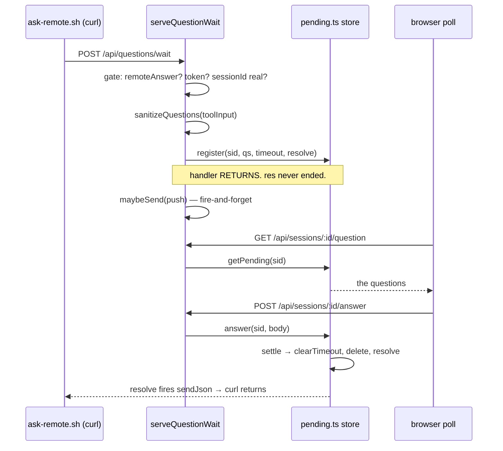
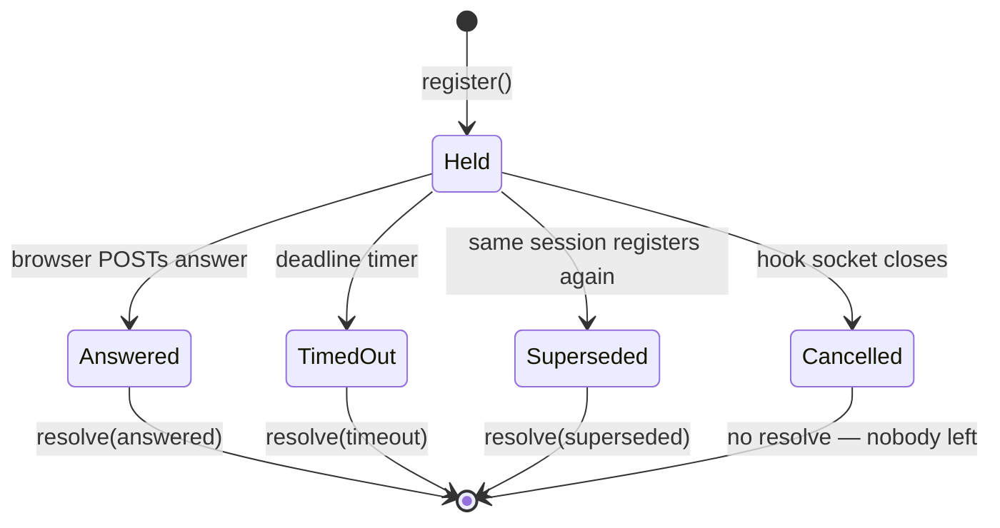

# The held socket

The server half. How an HTTP response stays open for ten minutes, and why the store that
owns it knows nothing about HTTP.

> Mental model: the hook's `curl` is blocked, so the handler's job is to **not answer**. It
> registers a callback and returns without ending the response. The socket stays open; the
> store fires the callback later; only then does `curl` return and the hook print its
> decision.

## 1. The handler that deliberately doesn't respond



The whole mechanism is six lines:

```ts
// server/api.ts:506-512
let questionId = '';
res.on('close', () => { if (questionId) cancelPending(sessionId, questionId); });
questionId = register(sessionId, questions, clampTimeout(body.timeoutMs), (result: WaitResult) => {
  if (res.writableEnded) return;
  sendJson(res, 200, result);
});
if (res.destroyed) cancelPending(sessionId, questionId);
```

**Why the push comes last:**

```ts
// server/api.ts:514-515
// Last, so a refused registration never pushes. Returns immediately — the
// response above stays held either way.
```

Every gate that can reject the registration runs before `maybeSend`, so you never get a
"question waiting" buzz for a question that was rejected as malformed.

## 2. The store takes an injected `resolve`, not the response

This is the best decision in the subsystem. [`pending.ts`](../../../../../server/lib/pending.ts)
imports **no HTTP types at all** — it takes a `(r: WaitResult) => void`:

```ts
// server/lib/pending.ts:14-15
 *  - No HTTP types. The handler injects `resolve`, which is what makes the whole
 *    state machine unit-testable (see test/pending.test.ts).
```

**What it does:** the store is a pure state machine over a `Map<string, Entry>`. Registering
takes a callback; settling calls it.

**Why:** testability, and reuse. The same shape appears verbatim in
[`plans.ts`](../../../../../server/lib/plans.ts) and [`messages.ts`](../../../../../server/lib/messages.ts).

**The bad alternative** — store the `ServerResponse` in the entry and call `res.end()` inside
the store:

| | injected `resolve` (chosen) | store the `res` |
|---|---|---|
| Unit-testable | `test/pending.test.ts` passes a plain function and asserts on what it gets | Needs a fake socket, or a real server per test |
| Coupling | Store knows nothing about HTTP | Store owns transport *and* lifecycle |
| Reuse | Same shape reused verbatim 3× | Re-derived 3× |
| Cost | An indirection, and the handler must guard `writableEnded` itself | Slightly less ceremony |

That `writableEnded` guard is the price paid. The store promises to fire `resolve` at most
once, but the *response* can die independently of the store, so the handler double-checks
before writing to it.

## 3. `settle` is the entire state machine

```ts
// server/lib/pending.ts:159-163
function settle(entry: Entry, result: WaitResult): void {
  clearTimeout(entry.timer);
  if (entries.get(entry.sessionId) === entry) entries.delete(entry.sessionId);
  entry.resolve(result);
}
```

Every exit routes through it — `answered`, `timeout`, `dismissed`, `superseded`, and (in
`messages.ts`) `released`. Three lines, three invariants:

- **`clearTimeout`** — the deadline can never fire after another exit won.
- **The identity check** — `entries.get(…) === entry` means a *superseded* entry does not
  delete the replacement that just evicted it. Without it, `register`'s supersede path would
  remove the new entry from the map while leaving it live in a closure.
- **`resolve` last** — the map is already consistent before anyone is notified.

## 4. The three-way race

Three things can end a wait, and they genuinely race:



`Cancelled` is the one that needed care. The hook dying — Ctrl-C, CLI hook timeout, session
interrupted — shows up only as a closed socket:

```ts
// server/api.ts:502-505
// The hook's socket closing IS the signal that nobody is waiting any more
// (session interrupted, hook killed, CLI hook timeout). Listen before
// registering, and re-check after, so a socket that dies during the body read
// can't leave an entry parked until its deadline.
```

**Why both a listener and a re-check:** `readJsonBody` is `await`ed, so the socket can die
*during* the body read — before the listener is attached, after which `close` never fires
again. The `res.destroyed` re-check catches exactly that window.

**Why `cancel` takes a `questionId`:**

```ts
// server/lib/pending.ts:249-254
export function cancel(sessionId: string, questionId: string): void {
  const entry = entries.get(sessionId);
  if (!entry || entry.questionId !== questionId) return;
  clearTimeout(entry.timer);
  entries.delete(sessionId);
}
```

The map is keyed by session, so a re-registration replaces the entry. Without the id check, a
*late* socket-close from the dead first wait would delete the *live* second one. The id makes
every terminal operation idempotent per entry. The browser echoes it back when answering too,
which is what makes a stale phone tab 404 instead of answering the wrong question.

## 5. No locking, and the invariant that makes that safe

```ts
// server/lib/pending.ts:218-222
/**
 * Answer (or dismiss) a session's pending question. Synchronous by design:
 * Node is single-threaded, so two tabs submitting at once means the first wins
 * outright and the second sees `not-found`, with no locking.
 */
```

**Why no mutex:** a single-threaded event loop plus a fully synchronous `answer()` means the
critical section cannot be interleaved. The load-bearing invariant is that `answer` contains
**no `await`** — that is the thing to protect if anyone edits it, not a lock.

**The bad alternative** is a mutex or a compare-and-swap flag: real added complexity to buy a
guarantee the runtime already provides. The trade-off they accepted is that the invariant is
implicit — nothing mechanically stops someone adding an `await` to `answer()` and quietly
introducing a race. The doc comment is the only guard.

## 6. Four stores, three shapes

| Store | Held socket? | Verdicts | Distinctive |
|---|---|---|---|
| [`pending.ts`](../../../../../server/lib/pending.ts) | yes | answered / timeout / dismissed / superseded | `sanitizeQuestions` + `validateAnswer` |
| [`plans.ts`](../../../../../server/lib/plans.ts) | yes | rejected only | accept refused upstream |
| [`messages.ts`](../../../../../server/lib/messages.ts) | yes | + **released** | the 5s idle reaper |
| [`permissions.ts`](../../../../../server/lib/permissions.ts) | **no** | none | display-only, 30min TTL |

**Why three modules rather than one generic store:**

```ts
// server/lib/messages.ts:13-15
 * Third parallel store, same state machine as `pending.ts`/`plans.ts` (same
 * injected `resolve`, same one-entry-per-session rule), separate module for the
 * same reason `plans.ts` is: the payloads and verdicts share nothing.
```

The *state machine* is identical; the *types* share nothing. `pending.ts` validates a
structured answer against the questions it claims to answer; `messages.ts` takes a string;
`plans.ts` has one verdict. A generic store would be parameterized over payload, verdict
union, and validation — three type parameters to save maybe forty lines, and every call site
would read worse. The duplication is deliberate and the comments say so at each site.

`pending.ts` also carries validation the others don't need, and it is worth noting what it
*declines* to check:

```ts
// server/lib/pending.ts:115-116
 * Values are deliberately NOT checked against the option labels: the terminal
 * dialog always offers a free-text "Other", and the panel mirrors that.
```

Rejecting unknown values would be the obvious "safer" choice and would break the free-text
path that the terminal dialog has always had. The caps (`SELECTED_CAP = 500`) do the
memory-safety job instead.

## 7. `permissions.ts` — the instructive outlier

No socket, no resolve, no verdict:

```ts
// server/lib/permissions.ts:10-12
 * Display-only. Unlike `pending.ts` there is no held socket and no resolve: the
 * CLI offers no way for anything outside the TUI to answer a permission dialog,
 * so this store records a fact and nothing more. Answering stays in the terminal.
```

And the hook is kept deliberately incapable:

```bash
# scripts/permission-notify-hook.sh:23-26
# DISPLAY-ONLY, unlike ask-remote-hook.sh. This hook never prints anything on
# stdout, which for PermissionRequest means "no decision" — the prompt renders
# exactly as it would have. Do not make it emit a decision: an `allow` reaching
# in over HTTP would turn the dashboard into a remote permission bypass.
```

That is a security boundary stated as a comment. The dashboard is reachable over your LAN or
tailnet; a hook that could turn an HTTP POST into an `allow` would make every permission
prompt in every session remotely bypassable.

**How the pill clears, given there is nothing to resolve.** This is the clever part:

```ts
// server/lib/permissions.ts:17-20
 * Clearing is the scan's job, not this store's: answering the dialog (approve
 * OR deny) appends a record to the transcript, so `lastMessageTs > notifiedAt`
 * means the wait is over. The TTL below is only a backstop for the paths that
 * never append — a killed session, a dismissed dialog, a lost notify.
```

**The bad alternative** — a short TTL as the primary mechanism:

| | transcript comparison (chosen) | short TTL |
|---|---|---|
| Correctness | Causal — the clear happens because you answered | Guessed from elapsed time |
| Long dialogs | Pill stays until answered, however long | Clears early; row lies |
| Dead sessions | 30min backstop catches them | Also caught |
| Cost | The scan must carry `notifiedAt` comparison logic | Trivial |

Deriving it from the transcript makes the clear *causally* correct rather than
probabilistically correct — and the TTL is kept, demoted to a backstop for the paths where no
record is ever appended.

---

**Next:** [The Stop-hook chat loop](./stop-loop.md) — the store that needed a reaper.

[↑ back to contents](../README.md)
