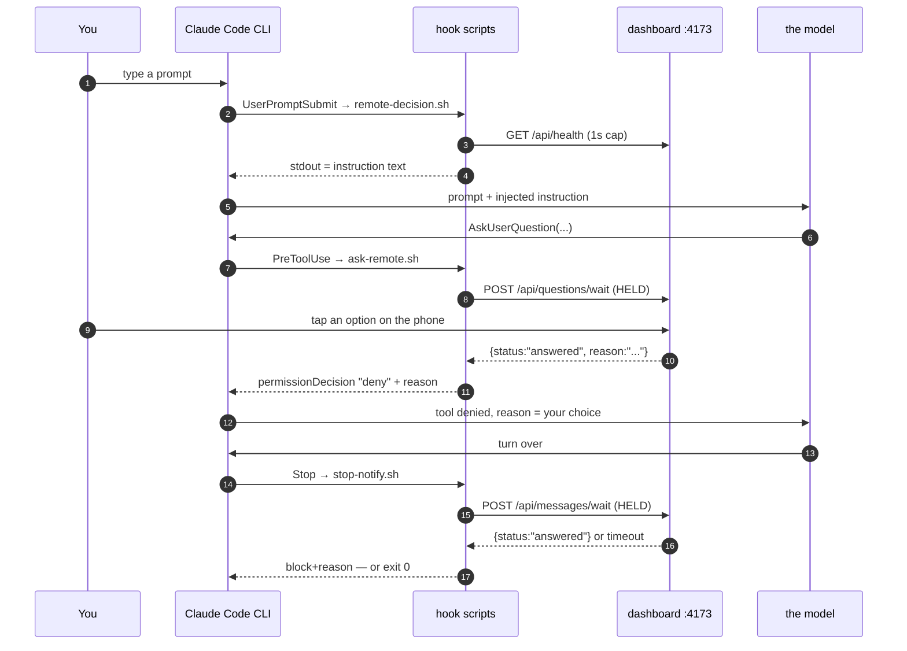

# The lifecycle and execution order

The five events, what fires when inside one real turn, and the ordering facts that catch
people out.

> Mental model: hooks fire **per event, not per turn**. There is no guarantee that a turn
> sees the front of the lifecycle at all — a turn resumed by a `Stop` block skips
> `UserPromptSubmit` entirely, and that single fact explains a design decision two chapters
> later.

## 1. What a hook actually is

A hook is an entry in `~/.claude/settings.json` naming an event, an optional tool matcher, a
shell command, and a timeout. When the event fires, the CLI runs the command as a
subprocess, writes a JSON payload to its stdin, and waits for it to exit. What it reads off
stdout — and which shape that output must take — depends on the event.

Two consequences follow immediately, and everything in this guide descends from them:

**a) The hook is synchronous.** The CLI is blocked while your script runs. That is what makes
a 600-second wait possible at all, and also what makes a slow hook a slow session. Every
non-blocking hook in this repo caps its network calls at 1 second for exactly this reason.

**b) The terminal UI renders *after* the hook exits.** So a question cannot be live in the
terminal *and* answerable on the phone. Something has to arbitrate — see
[Fail-open](./fail-open.md).

## 2. One real turn, end to end

You type a message, the model asks a question, then finishes:



## 3. `UserPromptSubmit` stdout becomes turn context

The first hook runs before the model sees anything, and its stdout is prepended to the turn:

```bash
# scripts/remote-decision-hook.sh:60-68  (abridged here — heredoc truncated at rule 1)
cat <<'EOF'
REMOTE DECISION MODE — the dashboard is accepting phone answers and this session
runs without permission prompts. The user may be away from the terminal: they can
answer the AskUserQuestion tool from their phone, but they cannot read a
plain-text question or approve a plan card. Therefore, for this session:
1. Put EVERY decision through the AskUserQuestion tool — approach choices,
   "should I proceed?", scope calls, and questions a skill tells you to ask
   (e.g. the brainstorming skill's session-mode pick). Never end a turn on a
   prose question.
EOF
```

**Why a hook rather than a line in `CLAUDE.md`.** The instruction is only correct under two
live conditions — the dashboard is accepting phone answers, *and* this session runs in an
auto-ish permission mode. Both are re-checked on every prompt, so flipping the dashboard
toggle takes effect on your next message.

**The bad alternative** is putting it in `CLAUDE.md` (or a rules file):

| | `UserPromptSubmit` hook (chosen) | a line in `CLAUDE.md` |
|---|---|---|
| Correct when at the desk | Silent — prints nothing, costs zero tokens | Always present; tells the model to avoid plan mode even when you are sitting there |
| Responds to the toggle | Yes, next prompt | No — needs a file edit and a restart |
| Cost | ~1s health probe per prompt, two `jq` calls | Free |
| Scope | Per session, per condition | Every session in the project, unconditionally |

The condition check is the whole point. A permanently-installed instruction to never enter
plan mode would be actively wrong most of the time.

## 4. Two hooks on one event both run, in order

`UserPromptSubmit` has **two** registered entries in this setup: `codegraph-gate.sh` then
`remote-decision.sh`. Both execute, both print, and both blocks land in the turn. The same
is true of `PermissionRequest`, which carries `permission-notify.sh` (all tools) and
`plan-remote.sh` (`ExitPlanMode` only) — on a plan proposal, both fire.

This is why `plan-remote-hook.sh` re-checks the tool name even though its matcher already
narrows it:

```bash
# scripts/plan-remote-hook.sh:42-45
# A matcher is configuration, so never trust it alone: this hook must be inert
# for anything but a plan, whatever it ends up registered against.
TOOL=$(printf '%s' "$INPUT" | jq -r '.tool_name // empty' 2>/dev/null)
[ "$TOOL" = "ExitPlanMode" ] || exit 0
```

**Why not trust the matcher:** the matcher lives in `~/.claude/settings.json`, a file this
repo neither owns nor tests. Registered under a bare `PermissionRequest`, this script would
otherwise try to route *every* permission request in the session through the dashboard. The
guard is defence against your own config, not against the CLI.

**The bad alternative** — trusting the matcher — is not unreasonable; it is how most hooks
are written. The trade:

| | re-check `tool_name` (chosen) | trust the matcher |
|---|---|---|
| Misregistration | Inert; nothing happens | Hijacks every permission request |
| Lines of code | 2 | 0 |
| Testability | The script's behaviour is self-contained | Behaviour depends on an untracked file |

Two lines to make the script's contract independent of a file the repo can't see.

## 5. A continued turn skips the front of the lifecycle

This is the ordering fact worth memorizing. A `Stop` hook that blocks does not end the turn —
the model reads the reason and keeps working. But that continuation had **no user prompt**,
so `UserPromptSubmit` never fires, so `remote-decision.sh` never runs, so its instruction is
never injected.

The consequence: the away-mode instructions have to ride inside the `Stop` block's own
reason text, which is why [`messages.ts`](../../../../server/lib/messages.ts) composes prose
that carries both your follow-up *and* a re-statement of the rules:

```ts
// server/lib/messages.ts:44-48
/**
 * The prose the hook prints as the Stop block's `reason`. Two jobs: carry the
 * text, and carry the away-mode instructions — `UserPromptSubmit` hooks (the
 * remote-decision injection) do NOT fire on hook-continued turns, so this is
 * the only place the reminder can ride.
```

See [The Stop-hook chat loop](./stop-loop.md) for the rest of that mechanism.

## 6. The event inventory, and what is deliberately missing

| Event | Used here | Why / why not |
|---|---|---|
| `UserPromptSubmit` | yes | The one place to inject per-turn context |
| `PreToolUse` | yes, `AskUserQuestion` only | The only decision surface a phone can answer |
| `PermissionRequest` | yes, twice | Fires before the prompt is drawn, and carries `tool_name` |
| `Notification` | yes, legacy fallback | Fires ~6s after a permission dialog opens, only on some engines |
| `Stop` | yes | The turn-end reply window |
| `PostToolUse` | **no** | Nothing to ask a human after a tool has already run |
| `SessionStart` | **no** | The dashboard discovers sessions by scanning transcripts; no hook needed |
| `SubagentStop` | **no** | A subagent finishing is not a moment a human is asked anything |
| `PreCompact` | **no** | Same |

`Notification` deserves a note, because carrying both it and `PermissionRequest` looks like
belt-and-braces duplication and is not:

```bash
# scripts/permission-notify-hook.sh:12-18
#   PermissionRequest  fires on the ask path, immediately before the prompt is
#                      drawn, and carries tool_name + tool_input. Works in the
#                      desktop app. PREFERRED — register this one.
#   Notification       fires ~6s after a permission dialog opens (and is
#                      cancelled if you answer first), only on engines that emit
#                      it: CLI >= 2.1.233, and NOT the desktop app's bundled
#                      engine as of 2.1.229. Kept for older/terminal setups.
```

One script serves both, keyed off `hook_event_name`. **Why one script rather than two:** the
two events mean the same thing to the dashboard, and the store keeps one entry per session,
so whichever arrives first shows the pill and the second just re-arms it. Two scripts would
duplicate the payload parsing and the POST for no behavioural gain.

---

**Next:** [The answer channel: `deny` + reason](./answer-channel.md) — the trick that makes
any of this possible.

[↑ back to contents](../README.md)
