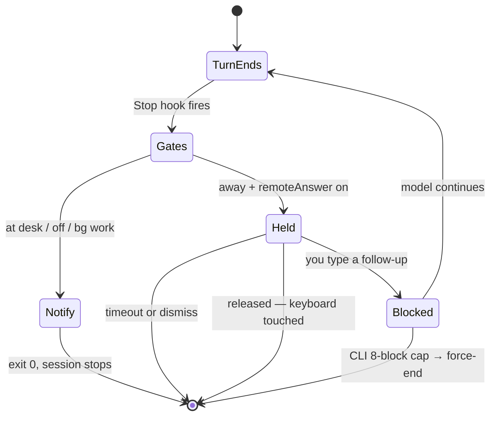

# The Stop-hook chat loop

The strangest of the five, because it turns a lifecycle hook into a conversation.

> Mental model: a `Stop` hook that **blocks** does not end the turn — the model reads the
> reason and keeps working. When it next finishes, `Stop` fires again. That is a loop, and
> the loop is the feature.

## 1. The loop



## 2. `stop_hook_active` was demoted from a guard to a payload field

Conventionally a `Stop` hook checks `stop_hook_active` and bails, to avoid an infinite loop.
This one can't:

```bash
# scripts/stop-notify-hook.sh:14-18
# The CLI caps consecutive Stop blocks at 8 (CLAUDE_CODE_STOP_HOOK_BLOCK_CAP),
# then force-ends the turn — so a phone conversation is at most 8 replies per
# stretch. stop_hook_active no longer short-circuits: mid-conversation stops
# must re-hold (that IS the chat loop); it rides in the POST body instead so the
# server skips the push you would not want mid-chat.
```

Bailing on that flag would cap the conversation at exactly **one** reply, because the second
turn-end is by definition a mid-hook-conversation stop.

So the flag changed jobs. It is no longer control flow; it is data:

```bash
# scripts/stop-notify-hook.sh:90-95
BODY=$(jq -cn \
  --arg sid "$SESSION_ID" \
  --arg pm "$PERM_MODE" \
  --argjson sha "$SHA" \
  --argjson t "$((TIMEOUT_S * 1000))" \
  '{sessionId: $sid, timeoutMs: $t, permissionMode: $pm, stopHookActive: $sha}') || notify_fallback
```

**Why this is safe:** the loop bound moved from the script to the platform. The CLI's own
8-block cap is the guard now, and it cannot be misconfigured away by editing this script —
because the script no longer holds that responsibility.

**The bad alternative** is keeping the guard and finding some other way to allow more than one
reply, e.g. a counter in the script or a server-side reply budget:

| | rely on the CLI cap (chosen) | keep the guard + own counter |
|---|---|---|
| Loop safety | Enforced by the CLI, unconditionally | Enforced by your own bookkeeping |
| State needed | None — the script is stateless | A counter that must survive across subprocess invocations |
| Conversation length | Up to 8 replies | Whatever you implement |
| Risk | You inherit a cap you don't control (8, via env var) | A bug in your counter is an infinite loop |

The script is invoked fresh per stop, with no memory. Any counter would have to live on disk
or on the server, and a bug in it means a session that never stops. Delegating to the
platform is strictly better here.

## 3. Two exits, and the old behaviour preserved byte-for-byte

`notify_fallback` is a shell function used as a jump target:

```bash
# scripts/stop-notify-hook.sh:58-65
notify_fallback() {
  [ "$SHA" = "true" ] && exit 0
  BODY=$(jq -cn --arg sid "$SESSION_ID" --arg pm "$PERM_MODE" \
    '{sessionId: $sid, event: "stop", permissionMode: $pm}') || exit 0
  curl -sf -m 1 -X POST -H 'Content-Type: application/json' "${AUTH[@]}" \
    -d "$BODY" "$DASH/api/notify/event" > /dev/null 2>&1 || true
  exit 0
}
```

Every non-hold path calls it. The header states the contract plainly:

```bash
# scripts/stop-notify-hook.sh:6-9  (abridged here — line 9 truncated)
# Two paths out of every run:
#   at the desk / feature off → POST /api/notify/event (the old fire-and-forget
#     push trigger) and exit 0 — byte-for-byte the pre-feature behaviour;
#   away + remote answers on  → POST /api/messages/wait, held.
```

**Why it matters:** the "task finished" push predates remote messages. Adding a hold could
easily have re-routed the old path through the new one — and then a bug in the hold logic
would take out notifications too. Instead the gates *add* a path; they never reroute the
existing one. Even `notify_fallback` is reachable from mid-flight failures: a non-2xx from
`/api/messages/wait` (feature flipped off, server restarted) falls back to the plain notify
rather than exiting silently.

Note also the `[ "$SHA" = "true" ] && exit 0` at the top of the function: mid-conversation
stops skip the notify, because *"the old script exited before notifying there too."* Even the
suppression is a preserved behaviour, not a new one.

## 4. Background work aborts before anything else

This runs before the health probe — before any network call at all:

```bash
# scripts/stop-notify-hook.sh:41-44
# Count in-flight background work. Missing keys -> [] -> 0 (safe fallback).
# Only the hook payload carries this, which is why the guard stays here.
bg=$(printf '%s' "$INPUT" | jq '((.background_tasks // []) | length) + ((.session_crons // []) | length)' 2>/dev/null || echo 0)
[ "${bg:-0}" -gt 0 ] 2>/dev/null && exit 0
```

**Why this one gate cannot move to the server:** the dashboard reads transcripts off disk. It
has no way to see in-flight background tasks or session crons — that information exists only
in the hook payload. Most of this subsystem pushes decisions serverward (prose, timeouts,
policy) precisely because the server is testable; this is the counter-example, and the comment
marks it as such.

**Why it aborts rather than holding:** a turn that ends with a background agent still running
is not really finished. The model will be re-invoked when that agent reports, so holding the
turn open would park a session that is about to continue on its own — and would burn one of
the 8 available blocks doing it.

## 5. The prose is a contract between two modules

`composeReason` carries your follow-up **and** re-injects the away-mode instructions:

```ts
// server/lib/messages.ts:55-62
export function composeReason(text: string): string {
  const trimmed = text.trim();
  return 'The user is away from the terminal and sent this follow-up from the dashboard; '
    + `treat it as their next message:\n${trimmed}\n\n`
    + 'Continue working on it now. The user is still away: put any decision through the '
    + 'AskUserQuestion tool, never end the turn on a prose question, and prefer '
    + 'already-permitted tools — a permission dialog would park the session until they return.';
}
```

**Why the instructions ride here:** as [the lifecycle chapter](./lifecycle.md) covers,
`UserPromptSubmit` does not fire on a hook-continued turn. There was no user prompt. So
`remote-decision-hook.sh` never runs and its injection never happens — this reason string is
the only vehicle left.

Then [`chat.ts`](../../../../../server/lib/chat.ts) mirrors that exact prose in a regex, to unwrap
the record back into a plain drawer message:

```ts
// server/lib/chat.ts:74-83
const REMOTE_MESSAGE_RE = new RegExp(
  '^(?:Stop hook feedback:\\n)?'
  + 'The user is away from the terminal and sent this follow-up from the dashboard; '
  + 'treat it as their next message:\\n'
  + '([\\s\\S]*)'
  + '\\n\\nContinue working on it now\\. The user is still away: put any decision through the '
  + 'AskUserQuestion tool, never end the turn on a prose question, and prefer '
  + 'already-permitted tools — a permission dialog would park the session until they return\\.'
  + '\\s*$'
);
```

Without it, your one-line follow-up would display in the chat drawer as the whole four-line
wrapper, instructions and all.

**The bad alternative** is a sentinel marker (`<!--remote-msg-->`) or a JSON envelope —
trivially parseable, no duplicated prose:

| | mirrored prose (chosen) | sentinel / envelope |
|---|---|---|
| What the model reads | Clean natural-language instruction | A marker it must be told to ignore |
| Parse robustness | Brittle — two copies must stay identical | Exact |
| Drift protection | `chat.test.ts` imports `composeReason` and pins both ends | Not needed |
| Failure mode | Record silently not unwrapped (cosmetic) | — |

They chose the *model's* reading experience over the parser's, and paid for it with a pinning
test. The comment is explicit that this is a deliberate fail-closed design:

```ts
// server/lib/messages.ts:50-53
 * ⚠️ `chat.ts` `REMOTE_MESSAGE_RE` mirrors this exact prose to unwrap the record
 * back into a plain drawer message. Editing the wording here without editing it
 * there breaks `chat.test.ts` — which is the point; it fails closed, and the
 * follow-up just stops showing in the drawer.
```

Each end carries a pointer to the other — `messages.ts` warns about the regex,
[`chat.ts:70-71`](../../../../../server/lib/chat.ts) notes that *"Both ends are anchored, so any
drift in that prose fails closed."* Both anchored, drift caught by a test, worst case
cosmetic. That is what makes an otherwise-fragile duplication affordable.

## 6. The reaper only `messages.ts` needs

`pending.ts` and `plans.ts` wait for you to *answer something*. `messages.ts` waits for you to
*maybe say something*. That difference earns it a reaper:

```ts
// server/lib/messages.ts:189-198
export function sweepIdle(): number {
  if (entries.size === 0) return 0;
  const thresholdSecs = getSettings().idleSecs;
  if (thresholdSecs === 0) return 0;
  const idle = (idleReader ?? readIdleSecs)();
  if (idle === null || idle >= thresholdSecs) return 0;
  const waiting = [...entries.values()];
  for (const entry of waiting) settle(entry, { status: 'released' });
  return waiting.length;
}
```

**Why:** when you walk back to your desk, the right behaviour is for the session to stop
immediately — not to make you find a phone panel and dismiss it. Hence the extra verdict,
`released`, which exists in no other store.

And the reaper self-terminates:

```ts
// server/lib/messages.ts:205-212
function ensureReaper(): void {
  if (reaper) return;
  reaper = setInterval(() => {
    sweepIdle();
    if (entries.size === 0 && reaper) { clearInterval(reaper); reaper = null; }
  }, 5_000);
  reaper.unref();
}
```

**The bad alternative** is a permanent 5-second interval started at boot:

| | on-demand reaper (chosen) | always-on interval |
|---|---|---|
| `ioreg` spawns when idle | Zero — *"an idle server never spawns `ioreg`"* | 17,280/day to serve an empty store |
| Holds the process open | No — `unref()` | Needs `unref()` anyway |
| Complexity | `ensureReaper` + the self-clear check | One line at boot |

The store is empty the overwhelming majority of the time, and each sweep shells out to
`ioreg`. Six extra lines to spawn no subprocesses when there is nothing to reap.

Note the fail direction, which is the *opposite* of the hook's:

```ts
// server/lib/messages.ts:185-187
 * Fail directions: unreadable idle (Docker, non-macOS) → never release — the
 * deadline timer is the reaper of last resort. `idleSecs === 0` means the idle
 * gate is disabled everywhere else, so it disables auto-release too.
```

Auto-releasing on a guess would end a turn you were about to reply to. See
[Fail-open](./fail-open.md) for all three directions side by side.

---

**Next:** [Fail-open, hook by hook](./fail-open.md).

[↑ back to contents](../README.md)
