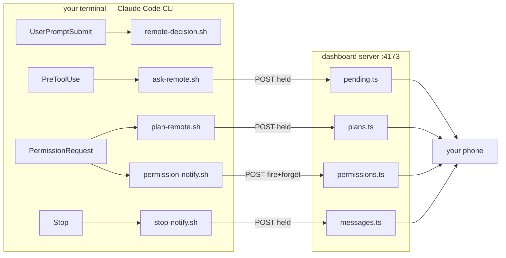

<!-- study-provenance: sources=scripts,server/lib/pending.ts,server/lib/plans.ts,server/lib/messages.ts,server/lib/permissions.ts,server/lib/remoteState.ts,server/lib/settings.ts,server/lib/notify.ts commit=092484b date=2026-08-17 -->

# Claude Code hooks in this project — a learning walkthrough

This guide teaches the five Claude Code lifecycle hooks this repo ships: what each one is,
where it is wired, what order they fire in, and — the part reference docs skip — **why each
piece is shaped the way it is**, by contrasting it with the naive approach and laying out
what that trade cost.

> **Mental model up front:** A Claude Code hook is the CLI shelling out to *your* script at
> one of five named moments in a turn, handing it JSON on stdin and reading a decision off
> stdout. This repo uses that mechanism for exactly one purpose: **making a terminal-bound
> session answerable from your phone.** Four of the five hooks are variations on a single
> trick, and once you see the trick, the whole subsystem collapses into something simple.

> **Read it in a browser:** [`index.html`](./index.html) — this whole guide as one page,
> with the diagrams drawn and every cross-reference as an in-page jump. It is **generated**
> from these markdown files by [`tools/build.mjs`](./tools/build.mjs), so edit the markdown
> and re-run `node docs/learning/hooks/tools/build.mjs`; never edit `index.html` by hand.

> Baseline: written against `scripts/` + the hook-facing `server/lib/` stores at commit
> `092484b` (2026-08-17).

---

## The shape of the whole thing



Five scripts. One of them only prints text. One of them only records a fact. The other three
are the same mechanism three times.

## The five scripts

All five live in [`scripts/`](../../../scripts), are symlinked into `~/.claude/hooks/`, and are
registered in `~/.claude/settings.json` — **not** in the repo. See
[Fail-open](./guide/fail-open.md) for why the install deliberately lives outside version
control.

| Script | Event | Matcher | Blocks? | Purpose |
|---|---|---|---|---|
| [`remote-decision-hook.sh`](../../../scripts/remote-decision-hook.sh) | `UserPromptSubmit` | all | no (~1s) | Injects the "route decisions through AskUserQuestion" instruction |
| [`ask-remote-hook.sh`](../../../scripts/ask-remote-hook.sh) | `PreToolUse` | `AskUserQuestion` | yes, ≤600s | Offer the question to your phone |
| [`plan-remote-hook.sh`](../../../scripts/plan-remote-hook.sh) | `PermissionRequest` | `ExitPlanMode` | yes, ≤600s | Offer a plan to your phone (reject-only) |
| [`permission-notify-hook.sh`](../../../scripts/permission-notify-hook.sh) | `PermissionRequest` + `Notification` | all | no (~1s) | Display-only: light up the `allow?` pill |
| [`stop-notify-hook.sh`](../../../scripts/stop-notify-hook.sh) | `Stop` | all | yes, ≤600s | Hold the finished turn open for a follow-up |

Note what is **absent**: no `PostToolUse`, no `SessionStart`, no `SubagentStop`, no
`PreCompact`. This project only hooks moments where **a human is about to be asked
something**. That is the organizing principle, and it is why the set is five rather than
fifteen.

## Chapters

1. **[The lifecycle and execution order](./guide/lifecycle.md)** — the five events, what
   fires when inside one real turn, and the three ordering facts that are easy to get wrong.
2. **[The answer channel: `deny` + reason](./guide/answer-channel.md)** — the keystone
   trick. There is no API for answering a tool call remotely, so the project abuses denial.
   Three events, three JSON shapes, and why plans can only ever be rejected.
3. **[The held socket](./guide/held-socket.md)** — the server half: how an HTTP response
   stays open for ten minutes, the four in-memory stores, the shared state machine, and the
   three-way race every wait can lose.
4. **[The Stop-hook chat loop](./guide/stop-loop.md)** — how a lifecycle hook becomes a
   conversation, why `stop_hook_active` was demoted from a guard to a payload field, and the
   prose contract between two modules.
5. **[Fail-open, hook by hook](./guide/fail-open.md)** — twelve bail-outs, one success path,
   and the three call sites that fail deliberately opposite ways on the very same signal.
6. **[Timeouts, gates, and config precedence](./guide/config.md)** — the four-layer timeout
   ladder, the three-source precedence chain, and the four independent gate stacks people
   conflate.

## FAQ

These are the questions actually raised while this guide was written.

### "Which 'hooks' — Claude Code hooks, or the React hooks in `client/src/hooks/`?"

Both exist in this repo and the words collide, so it is worth naming the difference once.
`client/src/hooks/` holds fifteen React hooks (`useSessions`, `usePendingQuestion`,
`useDictation`, …) — browser-side state and polling. This guide is about the **five shell
scripts in `scripts/`** that Claude Code executes at lifecycle events.

The tell is "order of execution": React hooks run in render order within one component, which
is a React question. Claude Code hooks fire at named moments in a turn, across process
boundaries, and *that* ordering is what the [lifecycle chapter](./guide/lifecycle.md) maps.
They do meet — `usePendingQuestion` polls the endpoint that `ask-remote-hook.sh` is blocked
on — but they are separate systems with separate failure modes.

### "What hooks are used, and where are they wired?"

Five scripts in [`scripts/`](../../../scripts), symlinked into `~/.claude/hooks/`, registered in
`~/.claude/settings.json`. The table above lists all five with their events and matchers. The
registration deliberately is **not** in the repo — see
[Fail-open §7](./guide/fail-open.md#7-the-install-lives-outside-version-control)
for why committing it would install blocking hooks into every session that opens this project.

To see the live wiring on your own machine:

```
jq '.hooks | keys' ~/.claude/settings.json
ls -l ~/.claude/hooks/
```

The `ls -l` matters: the entries are symlinks back into this repo, so `git pull` updates the
installed hooks while the registration stays put.

### "What is the order of execution?"

Within one turn: `UserPromptSubmit` → (`PreToolUse` / `PermissionRequest` per tool call) →
`Stop`. Two facts that surprise people:

1. **Two hooks on the same event both run, in registration order**, and both contribute
   output. This session's opening context contained a codegraph dump *and* a remote-decision
   banner because `UserPromptSubmit` has two entries.
2. **A turn continued by a `Stop` block skips `UserPromptSubmit` entirely** — there was no
   user prompt. That is why the away-mode instructions are duplicated into the `Stop` block's
   reason text rather than relying on the injection hook.

### "Why can a plan be rejected from the phone but not approved?"

The CLI discards a hook `allow` for any tool whose `requiresUserInteraction()` is true, and
`ExitPlanMode` is one of them. Not a design choice — see
[the answer channel §4](./guide/answer-channel.md). The interesting consequence is that a
*fifth* hook (`remote-decision-hook.sh`) exists purely to route around this limitation by
telling the model not to use plan mode at all.

### "How does an HTTP response stay open for ten minutes?"

The handler registers a callback and returns **without ending the response**. The socket stays
open; `curl` in the hook stays blocked; the store fires the callback later. See
[the held socket](./guide/held-socket.md). The reason the store can do this without knowing
anything about HTTP is that the handler injects a plain `resolve` function — which is also
what makes the whole state machine unit-testable.

### "Is the same fail-open rule applied everywhere?"

No, and that is the most instructive thing in the subsystem. The same unreadable-idle
measurement is handled three different ways in three places, because the cost of guessing
wrong differs at each: hiding a dialog from someone at their desk (expensive), sending one
extra push (cheap), ending a turn you were about to reply to (expensive). See
[Fail-open §6](./guide/fail-open.md).

### "How do I check this guide is still true?"

Two committed checkers:

```
node docs/learning/hooks/tools/citations.mjs
```

verifies every `file:N-M` excerpt label still points at the code it quotes, classifying each
as fresh / moved / gone / abridged. It found two real errors in this guide's first draft — a
label three lines off, and an excerpt where comment prefixes had been added to text that is
actually heredoc body.

```
node docs/learning/hooks/tools/check.mjs
```

verifies the generated page against the markdown: no dead links, no missing prose, no leaked
markdown, no external assets.

## The one-sentence summary

**Five scripts, one trick (`deny` + reason), three gates, twelve fail-open guards, and a
state machine that knows nothing about HTTP.**

---

**Relevant files**

- [`scripts/ask-remote-hook.sh`](../../../scripts/ask-remote-hook.sh) — the reference
  implementation of the blocking pattern; read this one first
- [`scripts/plan-remote-hook.sh`](../../../scripts/plan-remote-hook.sh) — same pattern,
  different output shape, reject-only
- [`scripts/stop-notify-hook.sh`](../../../scripts/stop-notify-hook.sh) — same pattern plus a
  loop and a fallback path
- [`scripts/permission-notify-hook.sh`](../../../scripts/permission-notify-hook.sh) — the
  display-only outlier; deliberately incapable of deciding
- [`scripts/remote-decision-hook.sh`](../../../scripts/remote-decision-hook.sh) — pure context
  injection, no HTTP wait
- [`server/lib/pending.ts`](../../../server/lib/pending.ts) — the state machine the other two
  wait-stores copy
- [`server/lib/plans.ts`](../../../server/lib/plans.ts) — same machine, reject-only verdicts
- [`server/lib/messages.ts`](../../../server/lib/messages.ts) — same machine plus the 5s idle
  reaper
- [`server/lib/permissions.ts`](../../../server/lib/permissions.ts) — flag store, no socket, no
  verdict
- [`server/lib/remoteState.ts`](../../../server/lib/remoteState.ts) — the env gate × UI toggle
  product the hooks act on
- [`server/lib/settings.ts`](../../../server/lib/settings.ts) — the idle/answer values the hooks
  read off `/api/health`
- [`server/lib/notify.ts`](../../../server/lib/notify.ts) — the push policy, and the clearest
  example of a deliberately inverted fail direction
- [`server/api.ts`](../../../server/api.ts) — the handlers that hold the sockets
- [`docs/subsystems/remote-answer.md`](../../../docs/subsystems/remote-answer.md) — the
  reference doc this guide is the *why* layer for
