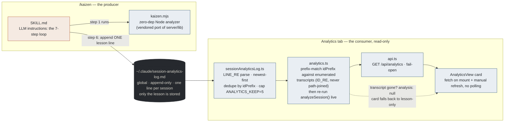
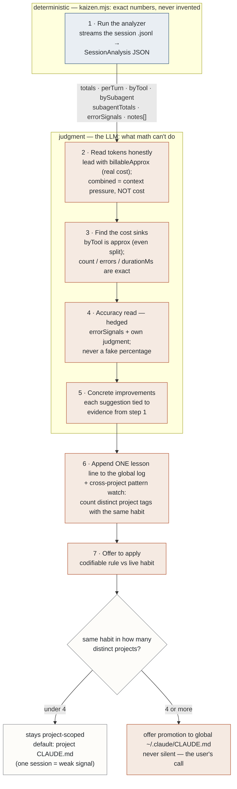
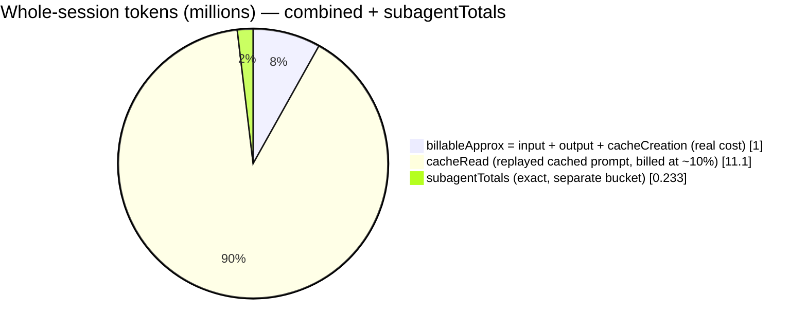
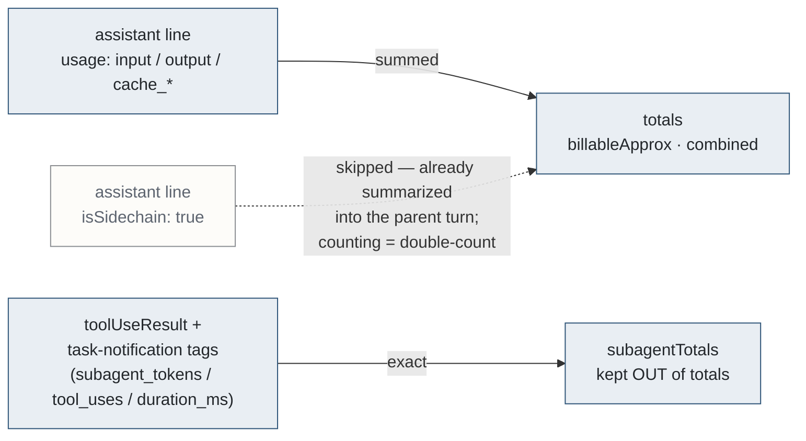
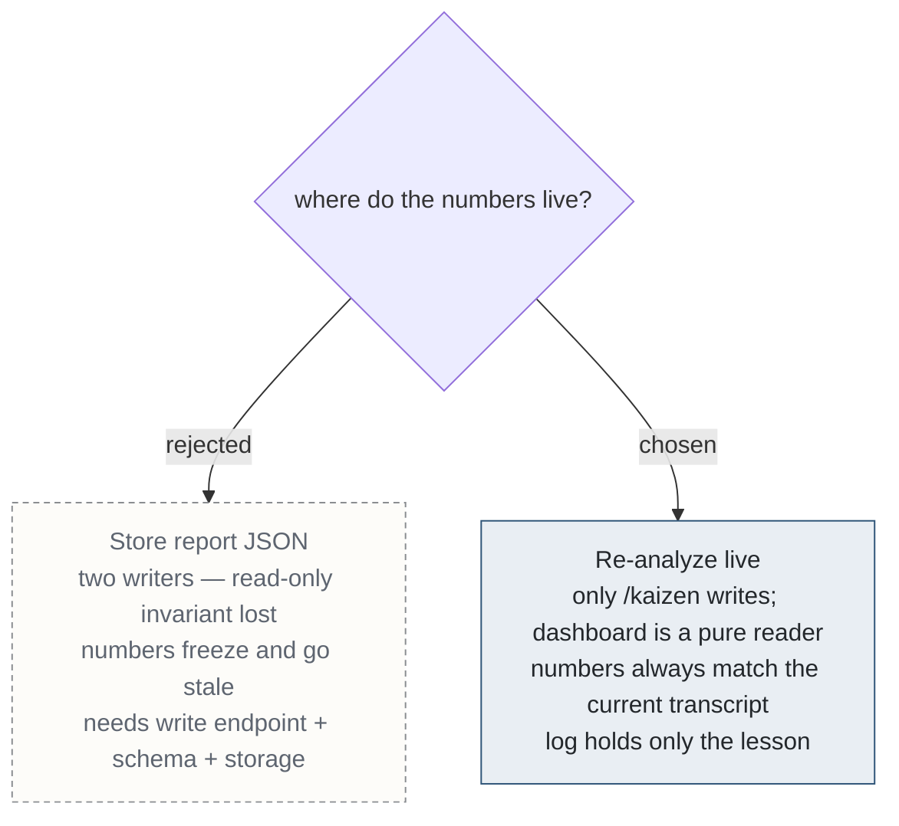

# kaizen + the Analytics tab — the diagrams

Visual companion to [kaizen-and-analytics.md](./kaizen-and-analytics.md). Same
content, drawn: the producer→consumer pipeline, the 7-step loop with its
deterministic/judgment split, the token-accounting model, and the
store-vs-recompute decision. Renders on GitHub and in VS Code markdown preview.

---

## 1. The pipeline: producer → wire → consumer

Nothing crosses this boundary except one text line per analyzed session. The
dashboard never writes.



The log line **contract format** (`SKILL.md`), and what the consumer's `LINE_RE`
actually extracts from it:

```
- 2026-07-12 [claude-agents-dashboard] d04e9b52: 1.0M billable (12.1M ctx), top cost 4 subagents (233k)... Lesson: subagents return terse findings, not prose.
  ^date      ^project                  ^idPrefix  ^-- numbers: human grep only, NOT parsed --------------^  ^lesson — the one thing that can't be recomputed
```

---

## 2. Inside /kaizen: the 7-step loop, two lanes

Step 1 is pure arithmetic (blue). Steps 2–5 are pure judgment (orange), each
grounded in a field the analyzer computed. They converge at step 6 — one log
line — and step 7 decides where the lesson lives.



---

## 3. Counting tokens honestly: two totals, three buckets

Example session from the doc: **1.0M billable** inside **12.1M** of context
traffic, plus **233k** of subagent work.



Reading it: `combined` (billable + cacheRead = 12.1M) is a *context-pressure*
signal, never "what this cost" — leading with it over-reports a long session
~10×. Whole-session ≈ `combined` + `subagentTotals.tokens`.

Why subagent tokens are skipped, then re-added:



What is exact vs approximate:

| Signal | Status |
| --- | --- |
| `byTool.count`, `errors`, `durationMs` | **exact** |
| subagent `tokens` / `toolUses` / `durationMs` | **exact** |
| `byTool.approxOutputTokens` | **approx** — even split of each turn's output across its tool calls; no per-tool field exists on disk |
| `errorSignals.userCorrections` | **noisy** — keyword lower bound, not a score |

---

## 4. The key design decision: store the report, or re-analyze live?

An earlier version had `/kaizen` POST full report JSON for the dashboard to
persist. It was scrapped.



The insight: **the numbers are deterministically recomputable, but the lesson is
not.** So the log stores only the irreducible human judgment, and re-running the
analyzer on every request — which looks expensive — is the cheap, correct choice.
